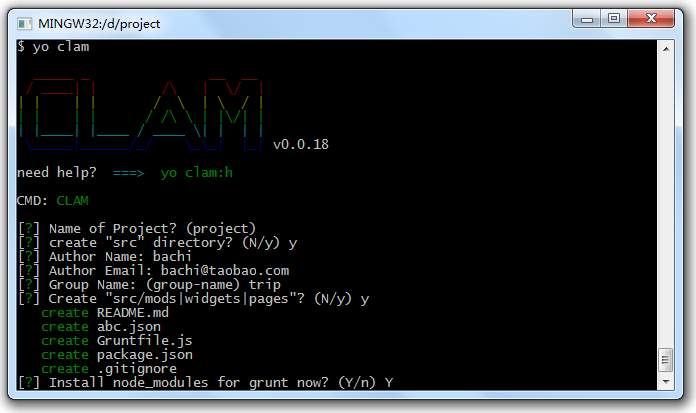

# KISSY 项目构建工具，Generator-clam

## What & Why

目标：是通过`yo clam`来将你引路到Grunt，帮助你更熟练的使用Grunt。

面向人群：面向阿里系前端工程师，帮助你创建标准的KISSY项目结构代码和Widgets代码。

愿景：打造一款无负担的前端开发脚手架工具，打破产品间的代码共享壁垒，让你的代码充溢阳光沙滩般的气息。

工具介绍PPT：[PPT](https://speakerdeck.com/lijing00333/generator-clam)。

环境依赖：Node、Npm，视频演示：[http://ascii.io/a/4384](http://ascii.io/a/4384)。

## 安装 & 基本命令

首先安装[grunt](http://gruntjs.com) 和 [yeoman](http://yeoman.io/)：

	npm install yo grunt-cli -g

 安装Generator-Clam：

	npm install -g generator-clam generator-kissy-gallery

命令：

- `yo clam:h`:打印帮助
- `yo clam`:初始化一个标准的Project
- `yo clam:mod`:初始化一个模块
- `yo clam:widget`:初始化一个标准kissy组件，首先创建组件空目录，进入空目录后执行此命令
- `yo clam:widget x.y`:生成一个标准kissy组件的版本，进入到组件目录后执行。其中x.y是版本号
- `yo clam:on`:启动web服务，服务支持SSI，推荐使用`grunt server`
- `yo clam:install <git>`:(TODO)git可以是git地址，也可以是Gallery模块名称，都将对应的git项目源码下载到本地，类似`svn export`
- `yo clam:search <name>`:(TODO)在Gallery中查找现有的匹配的模块名称
- `yo clam:page`:生成一个Page

部分子业务线的构建命令(TODO)：

- `yo clam:cp` 彩票
- `yo clam:trip` 旅行
- `yo clam:cph5` 彩票h5
- `yo clam:triph5` 旅行h5
- `yo clam:wt` 网厅
- `yo clam:tcc` 充值

## Grunt 内嵌命令

初始化完成的项目包含Gruntfile.js模板，可以辅助你完成：

- `grunt`: 执行构建
- `grunt prepub`:执行预发
- `grunt publish`:执行发布
- `grunt info`:查看当前库git地址
- `grunt newbranch`:创建新daily分支，基于当前版本累加
- `grunt listen`:监听文件修改，实时编译
- `grunt server`:开启本地调试模式
- `grunt build`:构建包含SSI的html，合并页面中的css和js

### 本地调试

本地调试调用了[flex-combo](https://npmjs.org/flex-combo)，访问绝对路径时和本地目录有一个映射关系，比如绝对地址映射到项目的`src`目录：

	http://g.tbcdn.cn/group/project/ => ./src/

启动本地服务：`grunt server`

### grunt 构建配置项

`Gruntfile.js`是Grunt脚本规则文件，此外项目基本参数存放在`abc.json`中，生成好的`abc.json`格式如下：

	{
		"name": "h5-test",
		"desc": "description of your app",
		"type": "clam",
		"port":"80",
		"group":"trip",
		"src":"false",
		"version":"0.0.1",
		"author": {
			"name": "",
			"email": ""
		},
		"repository": {
			"type": "git",
			"url": "http://gitlab.alibaba-inc.com/trip/h5-test"
		}
	}

生成一个新的daily分支（`grunt newbranch`）时会自动更新`abc.json`的`version`字段。

> ps:grunt构建任务依赖`grunt-mytps`子任务，该子任务（上传本地图片到CDN并替换地址）依赖python，并需要安装[tpsmate](https://github.com/sodabiscuit/tpsmate)。

### 使用 Generator-Clam 应对这三种基本场景

1，创建新项目

`yo clam`构建新项目时会生成Gruntfile.js。之后你只需特别关注Gruntfile.js即可。

2，接手项目

如果你要接手一个项目，代码检出后即可进行调试；在运行`grunt`命令之前需要运行`npm install`。 

3，标准格式的KISSY组件

[KISSY标准组件](http://gallery.kissyui.com)的构建使用`yo kissy-gallery x.y`，已经被映射为`yo clam:widget`，KISSY标准组件是可以直接构建为可发布到淘宝CDN的代码，并提交至`kissy gallery`中。因此，你的项目中所有widgets都应当和KISSY标准组件格式保持一致，方便被其他项目使用。

### Demo的运行

推荐使用方法2

#### 方法1

Generator-clam 提供一个轻服务（只提供静态文件服务器、[Flex-Combo](http://npmjs.org/flex-combo) 和SSI支持），启动服务后你可以这样访问Demo：

	http://localhost:8888/src/pages/detail.html?ks-debug

> 这里的SSI兼容apache，但这个Server还是功能很弱，且不支持脚本，我们强烈建议您使用更成熟的[apache+php来作为本地demo服务](http://wiki.ued.taobao.net/doku.php?id=ued.bj:f2e:tbcdn)，Clam只作为构建工具使用。

#### 方法2

Grunt中模板中提供`grunt server`方法，开启本地服务，默认开启在80端口，在`abc.json`中修改端口配置。`grunt server`封装了`flexcombo`，提供一种最基本的服务：即线上CDN环境映射到本地目录，直接访问屏幕提示给出的URL即可（g.tbcdn.cn host指向本地）

	[bachi@yahoo ~/temp/h5-test]> sudo grunt server
	Running "server" task

	Running "flexcombo:main" (flexcombo) task

	Preview: http://g.tbcdn.cn/trip/h5-test/

	Flex Combo Server running at http://127.0.0.1:80

访问demo时应当带上`?ks-debug`，上线后的项目引用`config.js`的绝对地址即可。

如果想测试build完成后的代码，可以在本地创建软连接，映射线上版本号，通过`grunt server`启动服务来测试：

	ln -s build src/0.1.8

访问`http://g.tbcdn.cn/group/project/0.1.8/.../demo.html`

### 预发和发布

为了限制在daily分支上发布，我们将grunt构建也加了限制，非daily分支上禁止构建，不建议将此限制去掉，只有build目录中的文件会被发布，所发布的项目中build目录中的文件地址为如下两种，前缀自选

	http://a.tbcdn.cn/g/group-name/project-name/x.y.z/mods.js

对应到 g.tbcdn.cn 的地址：

	http://g.tbcdn.cn/group-name/project-name/x.y.z/mods.js

代码发布命令：

- `grunt prepub` 预发
- `grunt publish` 发布

## 再多了解一点`Generator-Clam`

### CLAM 工具族

`Clam`是 [陶清](http://weibo.com/u/1846621405) 对于前端模块化开的实践和落地项目，它是一个工具，旨在建立标准的模块开发流程，提高代码共享和项目构建效率，同时提供一个本地轻服务，让我们“可以坐在美丽的沙滩上写代码”。

`Clam`之后有两个衍生版本，`Clam-tools`和`Generator-Clam`。

1，[Clam](http://gitlab.alibaba-inc.com/clam/tree/master)

clam包含一套完整的模块化开发思想，用来规范结构化越来越强的前端页面，Clam创建之初还没有Grunt，Clam用Grunt的思路来提供脚手架，用来应对页面结构较为固定的开发场景。

2，[Clam-Tools](http://gitlab.alibaba-inc.com/jay.li/clam-tools/tree/master)

由于时间仓促，Clam没实现发布、自定义构建和对KISSY的解析，Clam-Tools弥补了这几个空缺，且提供了GUI工具，实现了基于Ant的一键式构建和发布，但前提是你的项目基于SVN发布。另外一个问题在于，前端工程师真的学不会Ant。

3，[Generator-Clam](http://github.com/jayli/generator-clam)

2013年淘系全面推广基于Gitlab的Assets发布，Generator-Clam 延续了Clam模块化的思想，结合Yeoman和Grunt提供了面向淘系前端环境构建脚手架工具，包含前端开发/构建/发布的全流程。Generator-Clam 对代码单元做更自由的定义，根据适用范围，任何代码单元从三个维度管理：

- 项目（project）（代码集合最大单位）
- 模块（module）（业务功能单元，部分业务之间可共用）
- 组件（widget）（可全局共用）

最初Clam独立出了Page，Page本身也是一个模块，这里统一用模块来管理。这里的`yo clam:page`只是生成一个引用了KISSY种子的空页面。

代码单元有自身属性，自身属性只是为了区分其适用范围和生命周期，为了保持约定简单，代码单元在层级上不再做规定，所有模块单元都相互平行，代码之间的依赖和相互引用，取决于你对业务的拆解，不是脚手架的职责。

最重要的，互联网项目的需求是涌现式的，项目的前端架构和设计是在开发中不断调整修改而来，而非开始就设计完成不再动了，这也是代码组织结构尽可能保持和业务弱相关的原因。

最最重要的，组件级（widget）代码从开始就保持标准规范（Kissy Gallery），抽离出项目更方便，这在无常的Web项目中是唯一的促成积累、沉淀代码的方法。

### 项目目录结构约定

`yo clam`可以引导你创建三种格式的目录结构，

第一种，`src`目录和`build`目录平行，`src`目录中直接承载代码单元

	./
	├── build/ - 构建完成后发布目录
	├── doc/ - 生成的文档目录
	├── Gruntfile.js
	└── src/ - 项目源码目录
		├── ~page1/ - 页面1
		│   ├── img/
		│   ├── index.css
		│   ├── index.html
		│   ├── demo.html
		│   └── index.js
		├── mod1/ - 模块1
		│   ├── img/
		│   ├── index.css
		│   ├── index.html
		│   └── index.js
		├── mod2/ - 模块2
		│   ├── img/
		│   ├── index.css
		│   ├── index.html
		│   └── index.js
		└── widget1/ - 一个Kissy组件
			├── 1.0
			│   ├── build/
			│   ├── demo/
			│   │   └── index.html
			│   ├── guide/
			│   │   └── index.md
			│   ├── index.js
			│   ├── meta/
			│   │   ├── alias.js
			│   │   └── modules.js
			│   ├── plugin/
			│   └── spec/
			└── Gruntfile.js

第二种，`src`目录中划分出`pages`/`mods`/`widgets`三个目录，主要是为了兼容老的Clam项目

第三种，代码单元和`build`目录平行，即无`src`目录：

	./
	├── build/
	├── doc/
	├── Gruntfile.js
	├── index.css - 入口css文件样板
	├── index.html - 入口html文件样板
	├── index.js - 入口js文件样板
	├── mod1/ - 模块1
	│   ├── img/
	│   ├── index.css
	│   ├── index.html
	│   └── index.js
	├── mod2/ - 模块2
	│   ├── img
	│   ├── index.css
	│   ├── index.html
	│   └── index.js
	└── widget1/ - 一个kissy组件
		├── 1.0/
		│   ├── build/
		│   ├── demo/
		│   │   └── index.html
		│   ├── guide/
		│   │   └── index.md
		│   ├── index.js
		│   ├── meta/
		│   │   ├── alias.js
		│   │   └── modules.js
		│   ├── plugin/
		│   └── spec/
		└── Gruntfile.js

以上三种目录结构中，widget均和KissyGallery标准组件保持一致。

## Q & A

1，'yo clam'安装node模块的时候报错？

	npm ERR! Error: EACCES, mkdir '/usr/local/lib/node_modules/grunt-xx'

- 原因：没有sudo
- 解决办法：在当前目录执行`sudo npm install`

2，tpsmate安装完了还是不能把图片自动上传CDN?

- 原因：需要首先找到`node_modules`中手动执行一次
- 解决办法：进入`node_modules/grunt-mytps/tasks/lib/tpsmate/src`，执行`python ./cli.py upload`，这时提示你输入TMS用户名和密码，完成即可

3，tpsmate安装完成，但执行报错？

- 原因：依赖包不完整
- 解决办法：安装tpsmate的依赖

	pip install -r node_modules/grunt-mytps/tasks/lib/tpsmate/src/requirements.txt

4，yo clam 构建好目录结构后安装npm包时间太长，怎么办？

- 原因：构建项目最后使用`npm install`安装npm包
- 解决办法：在首次构建项目的时候最后一步询问是否安装本地`node_modules`，输入`N`，在当前目录使用`npm install --link`，将包安装到全局。以后每次`yo clam`最后都不安装本地包，使用`npm install --link`来安装，速度会很快。

5，yo clam:mod 构建好一个模块后，怎么运行它？

直接访问生成好的html文件，`xx/index.html?ks-debug`，会有弹框"ok"。

6，生成的默认Gruntfile.js只根据入口文件合并JS，我如何生成依赖关系表mods.js ？

修改Gruntfile.js，参照注释修改kmc任务。有一点需要注意，如果要生成依赖关系表，你的JS源文件必须带有模块名定义，比如：

	// 模块名不能省略
	KISSY.add('grp/header/index',function(S){
		// your code
	});

7，`grunt server`启动报错`Error: listen EACCES。`

在Mac/Linux下需要root权限才能启用80端口，加上sudo
	
	sudo grunt server

8，`grunt server`提示Error: listen EADDRINUSE。

Flex Combo所需要使用的端口正在被使用中，如果这个端口是80端口，你需要检查系统中是否有其他web容器，比如Apache、Nginx等是否使用了80端口。如果不是，你需要检查是否系统中有其他Flex Combo正在运行。

9，运行`grunt server`时报错：“Error: EMFILE, too many open files”

运行：

	ulimit -n 10000

10，依赖的yeoman工具版本

该程序在yeoman 1.0.0-rc.1.1 版本下测试通过

11，grunt server后，访问我的文件报错：`Fatal error: Cannot read property 'host' of undefined`

是因为你访问的JS或CSS文件在本地不存在，且在线上也不存在，保证本地文件存在即可

默认情况下，你需要保证访问地址的host是g.tbcdn.cn或a.tbcdn.cn，如果使用别的域名，需要在`~/.flex-combo/config.json`中修改配置项：

	hosts:{
		'a.tbcdn.cn':'122.255.67.241',
		'g.tbcdn.cn':'155.238.23.250',
		'your.host.name':'155.238.23.250'//ip地址配置到对应的cdn地址
	}

## TODO

- JSON接口模拟和映射
- png 图片的压缩和优化
- 各条业务线的固定构建脚本
- `yo clam:install`/`yo clam:search`，安装和查找Gallery模块

